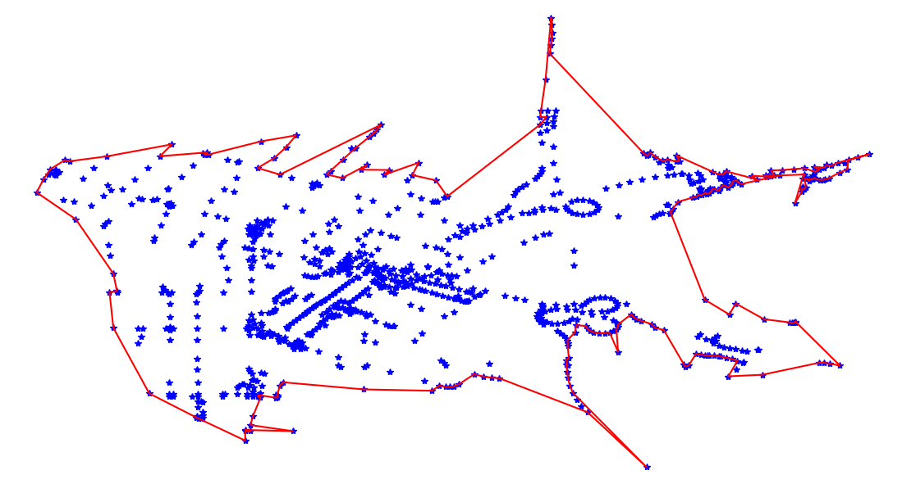

# concaveman-cpp
C++ port of mapbox's JS [concaveman](https://github.com/mapbox/concaveman), with a Python wrapper

Please take a look at my [blog](https://adared.ch/concaveman-cpp-a-very-fast-2d-concave-hull-maybe-even-faster-with-c-and-python/) for a longer introduction :)

